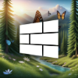

  
  <h1>Disco Tweaks - Theme Gallery</h1>
  
A collection of community-created themes for Disco Launcher.

## Available Themes

| Theme | | Details |
|-|-|-|
|  | **Frutiger Disco** | **Author:** [cherryhoax](https://github.com/cherryhoax)   **Description:** Frutiger Aero theme for Disco Launcher    |
|  | **Nothing**       | **Author:** [cherryhoax](https://github.com/cherryhoax)   **Description:** Nothing OS inspired theme for Disco Launcher.    |

---

## Installation

1. Make sure you have Disco Launcher 0.5.5.beta.5 or newer installed.
2. Click the "Install Theme" button on your mobile device.
3. When Disco Tweaks launches, tap "Install" in the theme popup.

## 🎨 Submit Your Theme

Want to create your own theme? Check the [Theme Creation Guide](./README.md#writing-styles) and submit a pull request to this file if you'd like!